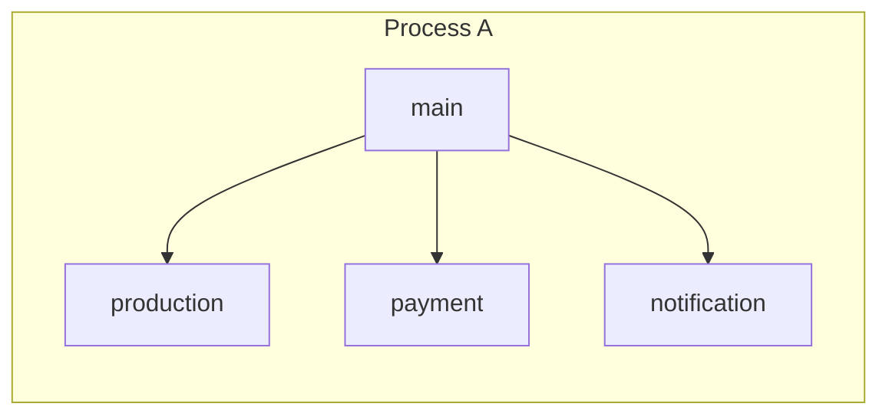
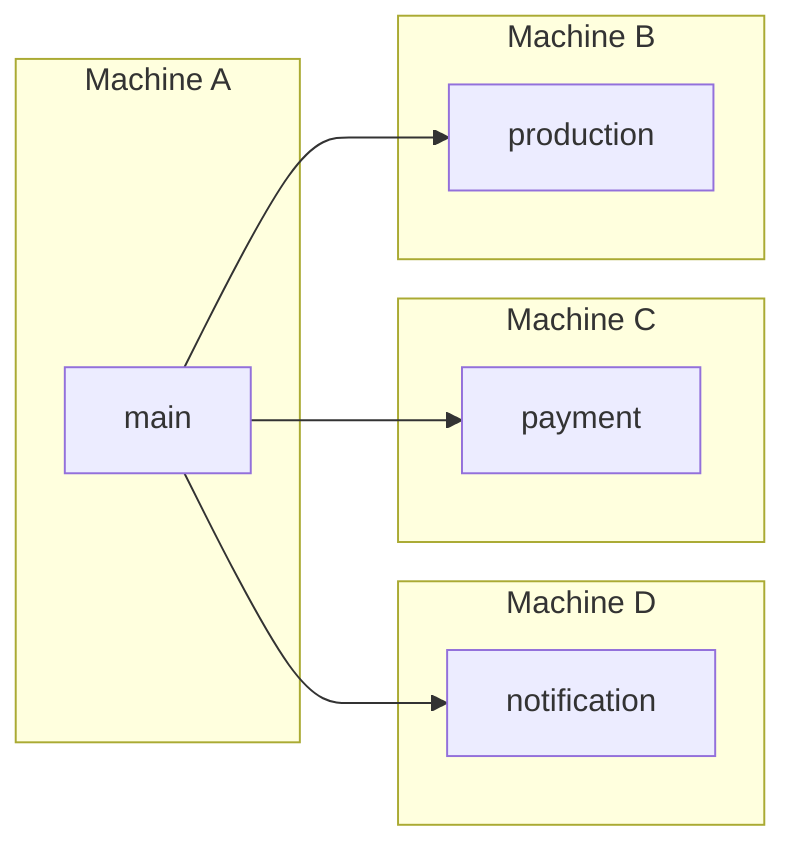

Hello Service Weaver
---

This is sample of [Service Weaver](https://serviceweaver.dev/), a programming framework for writing application as a modular binary and deploying it as a set of microservices.


## Description

This is a sample implementation of very simple e-commerce application with [Service Weaver](https://serviceweaver.dev/).

### Single Process

Architecture when executed in a single process.



### Multi Process

Architecture when executed in a multi process.


### Multi Machines

Architecture when executed in a multi machines.




## Structure

### Used language, frameworks

| language/frameworks                          | description                                                                                      |
|----------------------------------------------|--------------------------------------------------------------------------------------------------|
| [Service Weaver](https://serviceweaver.dev/) | framework for writing application as a modular binary and deploying it as a set of microservices |
| [Go](https://github.com/golang/go)           | programming language                                                                             |


## Usage

### 1. Build the applications

Be sure to run the following commands first to generate binaries.

```shell
make deps build
```

### 2. Run the application

You can run the application by executing the following command.

```shell
make weaver-${PROCESS_TYPE}-deploy

### Examples

## in a single process
# make weaver-single-deploy

## in a multi process
# make weaver-multi-deploy

## in a gke-local process
# make weaver-gke-local-deploy
```

For example, if the single process execution is successful, the output is as follows.

```
I0326 17:05:55.397787 notificationservice.T 27396897 service.go:39] initialize notification service
I0326 17:05:55.398017 productservice.T 27396897 service.go:43] initialize product service
D0326 17:05:55.398432 main    27396897 server.go:51] hello-serviceweaver service available address="[::]:8000"
╭───────────────────────────────────────────────────╮
│ app        : api                                  │
│ deployment : 87d07803-8311-42dd-af09-4d3ab5acfad2 │
╰───────────────────────────────────────────────────╯
```

### 3. Check communication to the API

You can check communication to the API by the following command.<br>
If it is successful, a list of products will be returned as a response.

```shell
make weaver-${PROCESS_TYPE}-test

### Examples

## in a single process
# make weaver-single-test

## in a multi process
# make weaver-multi-test

## in a gke-local process
# make weaver-gke-local-test
```

The following paths are implemented and can be checked too in the browser.<br>
Note, if `${PROCESS_TYPE}` is `gke-local`, you must add `Host: hello-serviceweaver.example.com` in the header. ([see also](https://serviceweaver.dev/docs.html#local-gke-getting-started))

| path                    | summary            |
|-------------------------|--------------------|
| /products               | list products      |
| /products/{id}          | get a product      |
| /products/{id}/purchase | purchase a product |

### 4. Refer to various information

Various options can be specified for the weaver command.<br>
For example, you can view the status of the Service Weaver application by executing the following command.

```shell
make weaver-${PROCESS_TYPE}-status

### Examples

## in a single process
# make weaver-single-status

## in a multi process
# make weaver-multi-status

## in a gke-local process
# make weaver-gke-local-status
```

If you run application as a single process, the output is as follows.

```
╭─────────────────────────────────────────────────────╮
│ DEPLOYMENTS                                         │
├─────┬──────────────────────────────────────┬────────┤
│ APP │ DEPLOYMENT                           │ AGE    │
├─────┼──────────────────────────────────────┼────────┤
│ api │ 87d07803-8311-42dd-af09-4d3ab5acfad2 │ 42m23s │
╰─────┴──────────────────────────────────────┴────────╯
╭─────────────────────────────────────────────────────────╮
│ COMPONENTS                                              │
├─────┬────────────┬───────────────────────┬──────────────┤
│ APP │ DEPLOYMENT │ COMPONENT             │ REPLICA PIDS │
├─────┼────────────┼───────────────────────┼──────────────┤
│ api │ 87d07803   │ notificationservice.T │ 1225         │
│ api │ 87d07803   │ paymentservice.T      │ 1225         │
│ api │ 87d07803   │ productservice.T      │ 1225         │
│ api │ 87d07803   │ main                  │ 1225         │
╰─────┴────────────┴───────────────────────┴──────────────╯
╭────────────────────────────────────────────────────╮
│ LISTENERS                                          │
├─────┬────────────┬─────────────────────┬───────────┤
│ APP │ DEPLOYMENT │ LISTENER            │ ADDRESS   │
├─────┼────────────┼─────────────────────┼───────────┤
│ api │ 87d07803   │ hello-serviceweaver │ [::]:8000 │
╰─────┴────────────┴─────────────────────┴───────────╯
```

For other commands and their details, please refer to the [official documentation](https://serviceweaver.dev/).
